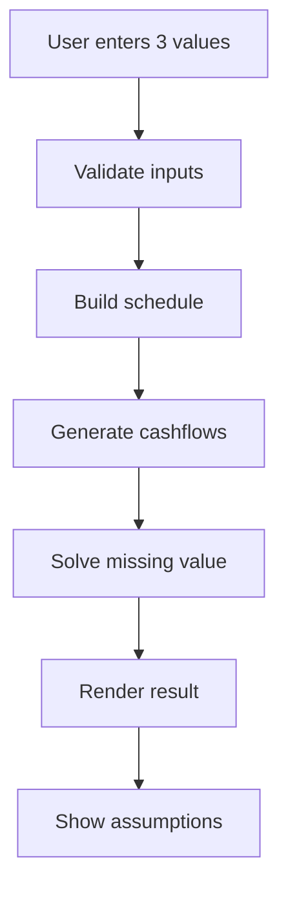

# Implementation Plan: XIRR Calculator

**Branch**: `codex/001-xirr-calculator` | **Date**: 2026-05-30 |
**Spec**: [spec.md](./spec.md)

**Input**: Feature specification from
`/specs/001-xirr-calculator/spec.md`

## Summary

Build a static, browser-only XIRR calculator where a user enters any three of
the four core values and calculates the missing fourth value. The app will model
regular monthly or yearly contributions with start/end timing, generate dated
cashflows, solve the missing value, and show a plain-language breakdown. The
site will live under `docs/` so it can be published by GitHub Pages with no
backend or paid hosting. The static page will also include search-friendly
metadata, crawlable XIRR guide content, FAQ structured data, `robots.txt`, and
`sitemap.xml` for the canonical GitHub Pages URL.

## Technical Context

**Language/Version**: HTML5, CSS3, JavaScript ES modules, Node.js 18+ for tests

**Primary Dependencies**: No runtime dependencies; Node built-in test runner
for automated tests

**Storage**: N/A; no server storage and no browser persistence for MVP

**Testing**: `node --test` for calculator logic, validation behavior, and SEO
metadata/assets; manual browser verification for UI workflows

**Target Platform**: Current desktop and mobile browsers; static GitHub Pages
hosting

**Project Type**: Static web application

**Performance Goals**: Calculator response under 100 ms for normal inputs; page
usable on mobile without layout overlap

**Constraints**: Browser-only execution; no login; no backend; no paid hosting;
no external analytics; all financial assumptions shown to the user

**Scale/Scope**: One public calculator page, four missing-value modes, monthly
and yearly schedules, start/end timing, INR default formatting, SEO metadata
and static crawler assets

## Constitution Check

*GATE: Must pass before Phase 0 research. Re-check after Phase 1 design.*

- **Static-First Delivery**: PASS. The app is static files under `docs/` and a
  GitHub Pages workflow.
- **Calculation Correctness**: PASS. Core logic will be isolated in
  `docs/src/calculator.js` and covered by automated tests.
- **Clear User Inputs**: PASS. UI requires exactly one blank core field and
  labels the missing value.
- **Test-First Core Logic**: PASS. Tasks place calculator tests before
  implementation.
- **GitHub Pages Readiness**: PASS. README and quickstart include local test,
  local run, and publish steps.

## Project Structure

### Documentation (this feature)

```text
specs/001-xirr-calculator/
├── spec.md
├── plan.md
├── research.md
├── data-model.md
├── quickstart.md
├── contracts/
│   └── ui-contract.md
├── checklists/
│   └── requirements.md
└── tasks.md
```

### Source Code (repository root)

```text
docs/
├── index.html
├── robots.txt
├── sitemap.xml
├── site.webmanifest
└── src/
    ├── calculator.js
    ├── main.js
    └── styles.css

tests/
├── calculator.test.js
└── seo.test.js

.github/
└── workflows/
    └── pages.yml

package.json
README.md
```

**Structure Decision**: Use a dependency-light static web app. `docs/` contains
the publishable GitHub Pages site and crawler assets, `tests/` verifies
calculation behavior and SEO-critical markup, and Spec Kit artifacts stay under
`specs/001-xirr-calculator/`.

## Design Flow



## Complexity Tracking

No constitution violations.
